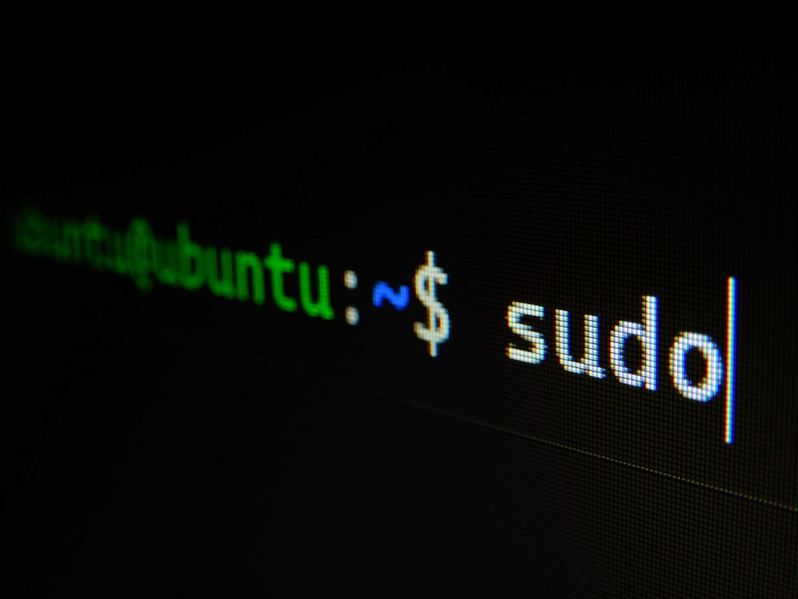

# Minishell

This project is about building a basic shell from scratch in C language by mimicking the fundamental functionality of Bash.

<p align="center">
  
</p>

## Key concepts

- Bash core functionality
- Signal handling
- File descriptors and input/output handling
- Pipes
- Environment variables
- Parsing

## Futures

- Commands history.
- Search and launch the right executable (based on the PATH variable or using a relative or an absolute path).
- Handle ’ (single quote) which should prevent the shell from interpreting the meta-characters in the quoted sequence.
- Handle " (double quote) which should prevent the shell from interpreting the meta-characters in the quoted sequence except for $ (dollar sign).
- Support < to redirect input.
- Support > to redirect output.
- Support << (heredocs) to read the input until a line containing the delimiter is seen.
- Support >> to redirect output in append mode.
- Implement pipes. The output of each command in the pipeline is connected to the input of the next command via a pipe.
- Handle environment variables.
- Handle $? which should expand to the exit status of the most recently executed foreground pipeline.
- Handle ctrl-C, ctrl-D and ctrl-\
- builtins:
  - echo with option -n
  - cd with only a relative or absolute path
  - pwd with no options
  - export with no options
  - unset with no options
  - env with no options or arguments
  - exit with no options
   
## Usage

- Compile
```
make
```
- Run the shell
```
./minishell
```

## Resources
- [Subject](./static/minitalk.pdf)
- [man7](https://man7.org/linux/man-pages/index.html)
- [Bash Reference Manual](https://www.gnu.org/software/bash/manual/bash.html)
